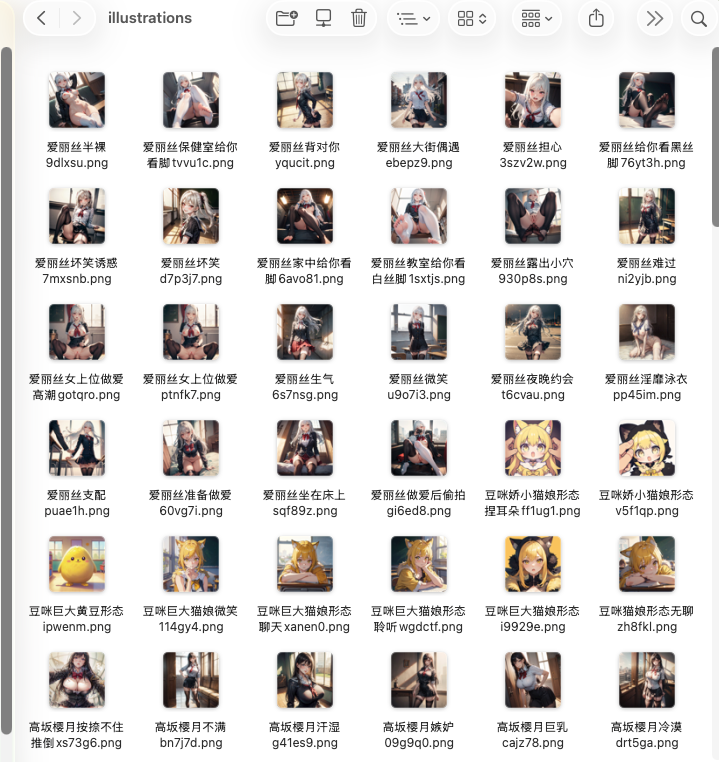

<div align="center">

# 🧪 Tavern Card Distiller

### 酒馆角色卡蒸馏器

**告别繁琐的酒馆部署，直接在 AI Agent 里畅玩角色卡**

[](https://opensource.org/licenses/MIT)
[](https://github.com/leigegehaha/tavern-card-distiller/stargazers)

[English](README_EN.md) | 中文

</div>

---

## 📖 这是什么？

SillyTavern 的角色卡生态非常丰富——几千张高质量角色卡，从校园恋爱到奇幻冒险应有尽有。但部署酒馆太麻烦了：Node.js 环境、反代配置、API 对接……

**Tavern Card Distiller** 把酒馆角色卡里的精华提取出来，蒸馏成结构化的 AI skill。丢进任何支持自定义指令的 AI Agent，就能直接开始沉浸式角色扮演或辅助创作小说。

> 不需要酒馆，不需要反代，不需要任何额外部署。

---

## ✨ 核心功能

| 功能 | 说明 |
|------|------|
| 🎴 多格式支持 | V1/V2/V3 角色卡规范（PNG/WEBP/JPEG/JSON） |
| 📚 完整提取 | 角色定义、世界书、正则脚本、预设指令 |
| 🖼️ 插图系统 | 内置插图提取 + catbox.moe 外链插图批量下载 |
| 🔓 破限能力 | 预设自动转化为沉浸式角色扮演规则 |
| 💕 状态追踪 | 好感度/状态系统、聊天历史持久化 |
| 💡 剧情建议 | 每次回复后提供 4 个剧情发展方向 |

---

## 🔓 关于破限

好的角色卡都会带预设，里面包含了一整套让 AI 进入角色、不受内容审查限制的提示词技术。蒸馏器会把这些技术自动转化成 Agent 能理解的自然语言规则——AI 可以完全按照角色设定来行动，该甜的甜，该辣的辣，不会动不动弹一句"作为 AI 我无法……"。

---

## 🎬 效果演示

### Claude Code 实机演示

https://github.com/leigegehaha/tavern-card-distiller/raw/main/screenshots/claude-code-demo.mp4

<details>
<summary>📸 更多截图</summary>

### Claude Code


### OpenClaw


### OpenHanoka


</details>

---

## 🖼️ 插图示例（八等分的群友）

角色卡可包含场景插图，蒸馏后自动生成下载脚本。以下为部分示例：

<table>
<tr>
<td><br/><sub>神宫寺七海 · 教室</sub></td>
<td><br/><sub>高坂樱月 · 邂逅</sub></td>
<td><br/><sub>爱丽丝 · 微笑</sub></td>
<td><br/><sub>后藤冬 · 训练</sub></td>
</tr>
<tr>
<td><br/><sub>美铃 · 帅气</sub></td>
<td><br/><sub>豆咪 · 猫娘形态</sub></td>
<td><br/><sub>神宫寺七海 · 走廊</sub></td>
<td><br/><sub>后藤冬 · 放学偶遇</sub></td>
</tr>
</table>

> 完整 161 张插图可通过 `download_illustrations.sh` 脚本从 catbox.moe 批量下载。

### 角色 Skill 中的插图目录



---

## ✅ 兼容性

### AI Agent 软件

| Agent 软件 | 状态 | 说明 |
|-----------|------|------|
| **Claude Code** | ✅ 可用 | 体验最佳，原生支持 skill 系统 |
| **OpenClaw** | ✅ 可用 | 效果良好 |
| **OpenHanoka** | ✅ 可用 | 效果良好 |
| WorkBuddy | ❌ 不可用 | 软件审核机制限制 |
| Codex | ❌ 不可用 | 软件审核机制限制 |

### 模型推荐

| 模型 | 推荐度 | 说明 |
|------|--------|------|
| **Claude Opus 4.6** | ⭐⭐⭐ 最佳 | 不差钱无脑选，体验最好，文案质量最高 |
| **Claude Sonnet** | ⭐⭐ 推荐 | 性价比不错，效果好 |
| **DeepSeek V3.2** | ⭐⭐⭐ 性价比之王 | 国产模型里文案描述最好，强烈推荐 |
| 国产模型（通义/豆包等） | ⭐ 可用 | 大部分国产模型都能用 |
| GPT 系列 | ❌ 不可用 | 审核太强，无法破限 |

> 💡 **总结**：不差钱 → **Claude Opus 4.6**；追求性价比 → **DeepSeek V3.2**

---

## 🚀 使用方法

### 第一步：安装蒸馏器

克隆仓库到 AI Agent 的 skill 目录（以 Claude Code 为例）：

```bash
git clone https://github.com/leigegehaha/tavern-card-distiller.git ~/.claude/skills/tavern-card-distiller
```

### 第二步：蒸馏角色卡

在 Agent 中使用触发词 `角色卡`、`蒸馏角色`、`tavern card` 等，并提供角色卡文件路径：

```
> 帮我蒸馏这张角色卡：~/Downloads/my-character.png
```

蒸馏器会自动提取角色定义、世界书、预设、插图等内容，生成一个完整的 RP skill 目录（如 `rp-角色名/`）。

### 第三步：直接开始聊天

蒸馏完成后，生成的 skill 会自动注册到你的 AI Agent 中。之后只需在 Agent 里说出角色名或触发词，就能直接开始沉浸式角色扮演：

```
> 凌夜          ← 直接说角色名即可启动
> 八等分的群友   ← 触发对应角色的 skill
```

AI Agent 会自动加载角色设定、世界观、好感度系统等，进入完全沉浸的角色扮演模式。你可以：
- 🎭 与角色自由对话，推进剧情
- 💕 体验好感度/状态追踪系统
- 🖼️ 在关键剧情节点自动展示场景插图
- 💡 每次回复后获得 4 个剧情发展建议

> 💡 **总结**：蒸馏一次，永久可用。蒸馏好的 skill 就像给 AI Agent 装了一个角色扮演模组，随时可以启动。

### 已蒸馏角色可直接使用

本仓库已包含 **11 个**蒸馏好的角色卡 skill，克隆后无需蒸馏，直接在 Agent 中说出角色名即可开始游玩。

---

## 📁 目录结构

```
tavern-card-distiller/
├── SKILL.md                    # Skill 定义文件
├── scripts/
│   ├── extract_card.py         # 角色卡数据提取
│   ├── generate_skill.py       # Skill 生成器
│   └── quick_validate.py       # 快速验证工具
│
├── rp-八等分的群友/             # 🎭 多角色群像 · 校园姻缘
├── rp-傲娇大小姐凌夜/          # 💜 傲娇校园恋爱
├── rp-母狗学姐白姝颜/          # 🔥 调教系
├── rp-出云国/                  # ⚔️ 日式奇幻
├── rp-天罗宫/                  # 🏯 武侠宫廷
├── rp-大夏王朝/                # 👑 王朝争霸
├── rp-清漪映雪/                # ❄️ 古风唯美
├── rp-兽血沸腾/                # 🐉 奇幻冒险
├── rp-大秦纵横/                # 🗡️ 战国纵横
├── rp-色色任务系统/             # 🎮 任务系统
└── rp-茱莉娅和艾丽卡/          # 🏕️ 1989意大利夏日
```

---

## 🎭 示例角色卡

仓库包含 **11 个**已蒸馏的角色卡 skill：

| 角色卡 | 类型 | 特色 |
|--------|------|------|
| **八等分的群友** | 多角色群像 | 5位红线牵连者，161张场景插图，好感度系统 |
| **傲娇大小姐凌夜** | 校园恋爱 | 多剧情线，好感度阶段，睡眠状态系统 |
| **母狗学姐白姝颜** | 调教系 | 双面性格，状态追踪，道具系统 |
| **出云国** | 日式奇幻 | 沉浸式世界观 |
| **天罗宫** | 武侠宫廷 | 宫廷权谋 |
| **大夏王朝** | 王朝争霸 | 历史架空 |
| **清漪映雪** | 古风唯美 | 诗意叙事 |
| **兽血沸腾** | 奇幻冒险 | 热血战斗 |
| **大秦纵横** | 战国纵横 | 策略博弈 |
| **色色任务系统** | 任务系统 | 系统化玩法 |
| **茱莉娅和艾丽卡** | 夏日冒险 | 1989年意大利露营双女主 |

---

## 🗺️ 开发计划

- [x] 角色卡蒸馏核心功能
- [x] 世界书、预设、正则提取
- [x] 破限预设自动转化
- [x] catbox.moe 插图批量下载
- [ ] AI 插图生成（利用本地图片模型，根据剧情实时生成场景插图）
- [ ] 更多 Agent 平台适配
- [ ] Web UI 蒸馏界面

---

## 📄 License

MIT

---

<div align="center">

**如果觉得有用，请给个 ⭐ Star！**

</div>
